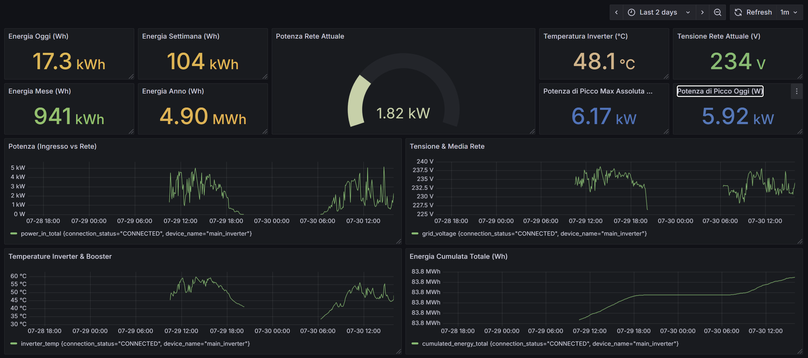

# Aurora-Inverter-Monitoring-System

A Docker-based and ESP32-powered system for monitoring Aurora/Power-One inverters. It collects real-time data, stores it in InfluxDB, and visualizes it via Grafana dashboards, with added support for voice control via Amazon Alexa.



## System Architecture

The system is composed of three main parts that work together: a physical ESP32 device reading data from the inverter, a Dockerized backend on a server that stores and processes this data, and a voice interface via an Alexa Skill.


## System Components

1.  **Docker Backend (on VPS/Server):**
    *   **InfluxDB 2.x**: Time-Series database.
    *   **Grafana**: Data visualization.
    *   **Python/Flask API**: Receives ESP32 data, writes to InfluxDB, and provides endpoints for voice assistants.

2.  **ESP32 Firmware (physical device):**
    *   ESPHome-based firmware connects to the inverter and sends data to the API.

3.  **Voice Assistant Integration (Amazon Alexa):**
    *   A custom Alexa skill communicates with an AWS Lambda function, which in turn queries the Flask API to retrieve data.

## Prerequisites

*   **Server/VPS**: With Docker, Docker Compose Plugin, and Git installed.
*   **NGINX Proxy Manager (NPM)**: Installed and configured on your server for subdomain/SSL management.
*   **ESPHome CLI**: On your local machine.
*   **Inverter**: Aurora/Power-One compatible.
*   **Hardware**: ESP32 board with RS485 adapter.
*   **Amazon Developer Account**: Required for creating the Alexa Skill and Lambda function.

## Installation and Configuration Guide

### 1. Docker Backend Setup (on Server)

1.  **Clone the Repository:**
    ```bash
    cd ~/projects/ # Or your preferred directory
    git clone https://github.com/mattiamelodia/Aurora-Inverter-Monitoring-System.git
    cd Aurora-Inverter-Monitoring-System/server-inverter-monitoring/
    ```
    *(Note: The backend is located directly in `server-inverter-monitoring/`).*

2.  **Configure `.env` File:**
    This file stores InfluxDB and Grafana credentials. **It must not be committed to Git.**
    Create/edit `.env` in `server-inverter-monitoring/`:
    ```bash
    nano .env
    ```
    Paste and **replace placeholder values with your own**:
    ```
    INFLUXDB_INIT_MODE=setup
    INFLUXDB_INIT_USERNAME=your_influxdb_user
    INFLUXDB_INIT_PASSWORD=your_influxdb_password
    INFLUXDB_INIT_ORG=your_influxdb_org
    INFLUXDB_INIT_BUCKET=your_influxdb_bucket
    INFLUXDB_INIT_ADMIN_TOKEN=your_influxdb_admin_token

    GRAFANA_USER=your_grafana_user
    GRAFANA_PASSWORD=your_grafana_password

    INFLUXDB_URL=http://influxdb:8086
    INFLUXDB_TOKEN=${INFLUXDB_INIT_ADMIN_TOKEN}
    INFLUXDB_ORG=${INFLUXDB_INIT_ORG}
    INFLUXDB_BUCKET=${INFLUXDB_INIT_BUCKET}
    ```
    Save and exit.

3.  **Start Docker Services:**
    From `server-inverter-monitoring/`:
    ```bash
    make inverter-monitoring
    ```

4.  **Verify Services:**
    ```bash
    docker ps
    ```
    Confirm `influxdb`, `grafana`, and `api-inverter` are `Up`.

### 2. NGINX Proxy Manager Configuration

Configure the following Proxy Hosts in NGINX Proxy Manager (`http://<YOUR_SERVER_IP>:81`) to securely access your services.

*   **Grafana:**
    *   Domain: `grafana.yourdomain.com`
    *   Forward Hostname / IP: `grafana`
    *   Forward Port: `3000`
    *   Enable SSL.
*   **Inverter API:**
    *   Domain: `api.yourdomain.com`
    *   Forward Hostname / IP: `api-inverter`
    *   Forward Port: `5000`
    *   Enable SSL.

### 3. Grafana Configuration

1.  **Access Grafana UI:**
    Navigate to your configured Grafana domain (e.g., `https://grafana.yourdomain.com`). Log in with your Grafana credentials from the `.env` file.
2.  **Import Dashboards:**
    Go to "Dashboards" -> "New Dashboard" -> "Import". Upload your `dashboard.json` and select the appropriate InfluxDB data source.

### 4. ESP32 Firmware Setup

This section covers configuring the physical ESP32 device to send data to your newly deployed API. The firmware and hardware connection logic are based on the work by **Michel Sciortino**.

**For detailed information on the hardware wiring, component selection, and the underlying firmware logic, please refer to the original repository first:**
[**https://github.com/michelsciortino/esphome-aurora-inverter**](https://github.com/michelsciortino/esphome-aurora-inverter)

This project leverages **ESPHome** to define the entire device logic—from hardware communication to data transmission via HTTP POST—in a simple and manageable `config.yaml` file.

1.  **Configure `config.yaml` and `secrets.yaml`:**
    The `config.yaml` file in `/esphome-aurora-inverter/` uses ESPHome's `secrets` mechanism for sensitive data.

    **You MUST create a `secrets.yaml` file** in the same directory (`/esphome-aurora-inverter/`) with your actual credentials and API base URL:
    ```yaml
    wifi_ssid: "Your_WiFi_SSID"
    wifi_password: "Your_WiFi_Password"
    inverter_api_url: "https://api.yourdomain.com"
    ```
    This `secrets.yaml` file is handled by `.gitignore` and is not part of the Git repository.

2.  **Compile and Upload:**
    From your local machine, navigate to the ESPHome project directory:
    ```bash
    cd /path/to/your/Aurora-Inverter-Monitoring-System/esphome-aurora-inverter/
    esphome run config.yaml
    ```
    Follow ESPHome's prompts to connect your ESP32 and upload the firmware.

### 5. Voice Assistant Integration (Amazon Alexa)

The project is architected to be easily extensible to multiple voice assistants. Currently, Amazon Alexa is fully implemented.

1.  **Create Alexa Skill:**
    *   Go to the [Alexa Developer Console](https://developer.amazon.com/alexa/console/ask) and create a new custom skill. Give it an invocation name (e.g., "inverter aurora").

2.  **Import Interaction Model:**
    *   In the "Build" tab of your skill, go to "JSON Editor".
    *   Delete the existing content and paste the entire content of the `assistants/alexa/skill-model.json` file from this repository.
    *   **Note on Customization:** The `samples` values within the JSON for each intent are the phrases that trigger an action. Feel free to modify, add, or delete these phrases to better match your way of speaking. The more varied examples you provide, the better Alexa will understand you.
    *   Click "Save Model", then "Build Model".

3.  **Create AWS Lambda Function:**
    *   Go to the [AWS Lambda Console](https://aws.amazon.com/lambda/) and create a new function from scratch in a supported region (e.g., `eu-west-1`).
    *   Choose a name (e.g., `inverterAlexaHandler`), select a Python runtime (e.g., Python 3.9+).

4.  **Configure Lambda Code:**
    *   In the "Code source" editor, paste the entire content of the `assistants/alexa/lambda_handler.py` file from this repository.
    *   Click **"Deploy"**.

5.  **Connect Skill to Lambda:**
    *   In the Lambda console, copy the function's **ARN** (top-right of the page).
    *   Go back to the Alexa Developer Console -> "Build" -> "Endpoint".
    *   Paste the ARN into the "Default Region" field. Save the endpoint.
    *   Go to the "Test" tab in the Alexa console to verify the integration.

---
## Technical Details and Credits

### Communication Protocol
The Aurora Communication Protocol (version 4.2), used for communication with the inverter, is detailed in this document:
[https://www.drhack.it/images/PDF/AuroraCommunicationProtocol_4_2.pdf](https://www.drhack.it/images/PDF/AuroraCommunicationProtocol_4_2.pdf)

### Core Libraries and Attributions

*   **ESP32 Firmware Base:** The ESPHome firmware configuration in this project is based on the foundational work by **Michel Sciortino**.
    *   Original Repository: [https://github.com/michelsciortino/esphome-aurora-inverter](https://github.com/michelsciortino/esphome-aurora-inverter)

*   **Inverter Communication Library:** The firmware leverages the `jrbenito/ABBAurora` C++ library for handling the RS485 communication protocol.
    *   Library Repository: [https://github.com/jrbenito/ABBAurora](https://github.com/jrbenito/ABBAurora)

This project extends and customizes these components for integration with a Dockerized backend and voice assistant control.